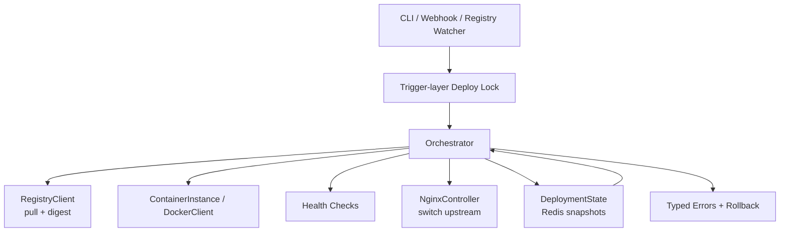

# Warden: Lightweight Deployment Orchestrator  
*A modular, container-native system for zero-downtime deployments — built for resilience, simplicity, and remote 
operation.

## Overview
Lightweight Python orchestrator for container deployment workflows, focused on health-aware rollout logic, Docker integration, and deployment state tracking.

## What This Solves

Warden addresses common reliability problems in small container deployments:

- **Downtime during releases:** uses blue/green style traffic switching so new versions are prepared before cutover.
- **Unsafe repeated triggers:** combines deploy locking and digest-based idempotency to avoid duplicate concurrent rollouts.
- **Unclear rollback state:** persists deployment snapshots in Redis so active/idle state and metadata are recoverable.
- **Operational drift:** central orchestration provides one deploy path across CLI, watcher, and webhook triggers.
- **Low observability:** structured logging and typed deployment errors make failures easier to diagnose.

## Project Goal

Warden is a lightweight deployment orchestrator for solo developers and small teams running containerized apps that need safer releases than plain Docker scripts, but do not want the operational overhead of Kubernetes.

It focuses on practical controls for that middle ground:

- blue/green-style traffic switching
- digest-aware deployment idempotency
- rollback backed by persisted deployment snapshots
- unified trigger interfaces (CLI, watcher, webhook)

Warden is intended as a usable deploy tool for small environments, while still serving as an engineering sandbox for orchestration patterns.

## Current Status

Warden is functional for local/containerized environments and currently in a hardening phase.

- Architecture: modular packages under `warden/`
- Runtime target: local Docker/Docker Compose
- Current capabilities: deploy/rollback orchestration, Redis-backed deployment snapshots, trigger-layer 
 locking, and digest-based idempotency
- Focus right now: failure-path test coverage and end-to-end operational hardening

## Repository Layout

Current project layout (some entries are placeholders for near-term additions):

```text
warden/
├── warden/
│   ├── __init__.py
│   ├── cli.py
│   ├── core/
│   │   ├── orchestrator.py
│   │   ├── state.py
│   │   └── errors.py
│   ├── docker/
│   │   ├── client.py
│   │   ├── registry.py
│   │   └── container.py
│   ├── health/
│   │   ├── checker.py
│   │   └── endpoints.py
│   ├── nginx/
│   │   ├── controller.py
│   │   └── config.py
│   ├── watcher/
│   │   ├── file_watcher.py
│   │   ├── registry_watcher.py
│   │   └── webhook_server.py
│   └── utils/
│       ├── logging.py
│       └── config.py
├── tests/
│   ├── test_orchestrator.py
│   ├── test_health.py
│   └── test_integration.py
├── docker-compose.yml
├── Dockerfile
├── requirements.txt
├── setup.py
├── Makefile
└── Readme.md
```

## Core Components

- `warden/docker/client.py`: low-level Docker operations (create/get/start/stop/remove/logs/network)
- `warden/docker/container.py`: container instance lifecycle orchestration
- `warden/docker/registry.py`: registry login and pull behavior
- `warden/watcher/registry_watcher.py`: registry polling loop for digest change detection
- `warden/watcher/webhook_server.py`: webhook entrypoint for deploy/rollback triggers
- `warden/health/checker.py`: HTTP health checks with retry/delay logic
- `warden/health/endpoints.py`: framework-specific health endpoint helpers
- `warden/core/state.py`: Redis-backed deployment snapshots (see below)
- `warden/core/errors.py`: typed deployment failures (`DeploymentError` and subclasses)
- `warden/utils/logging.py`: centralized root logger setup (JSON or plain formatter)

## Architecture Diagram



### Deployment state (snapshots)

Warden treats **`DeploymentSnapshot`** as the single source of truth for what is deployed. All writes go through **`DeploymentState.set_snapshot(snapshot)`** — there is no separate “set active color only” API, so Redis keys stay consistent.

- **`DeploymentSnapshot`** fields include active/idle slots (`blue` / `green`), version, timestamp, image digest, and container metadata.
- **`DeploymentSnapshot.minimal(active, idle)`** builds a snapshot when only routing slots are known (e.g. rollback with no prior record); optional fields are empty strings / zero as documented in code.
- **Redis keys** (prefix `{app_name}:`):
  - `snapshot:{blue|green}` — JSON for that slot’s last recorded snapshot
  - `active` — active color string (fast pointer)
  - `active_snapshot` — JSON for the currently active deployment (denormalized copy for one-shot reads)

Reads: **`get_active_snapshot()`**, **`get_snapshot(color)`**, **`get_active()`** (color string, derived from snapshot when present).

### Typed deployment errors

Orchestrator steps raise specific exceptions subclassing **`DeploymentError`** (e.g. **`ImagePullError`**, **`ContainerCreateError`**, **`TrafficSwitchError`**) so callers can handle expected failures without catching all `Exception`.

### Concurrency and idempotency

Warden uses a two-layer safety model for deployment triggers:

- **Trigger-layer deploy lock** (`cli` / webhook / watcher wrappers): prevents concurrent deploy executions
- **Orchestrator-level idempotency** (digest-based): skips redeploying the same artifact when digest matches 
prior in-flight/completed intent.

This split is intentional: lock handles **"how many deploys can run now"**, while digest idempotency handles **"is this the same artifact request"**.

### Logging

Warden configures logging at CLI startup using **`setup_logging()`** in `warden/utils/logging.py`.

- Module loggers use `logging.getLogger(__name__)` for consistent names (`warden.core.orchestrator`, `warden.docker.client`, etc.).
- Root logging can emit either JSON logs (`JSONFormatter`) or plain text.
- A single root handler is configured to avoid duplicate log lines when setup is called multiple times.

### CLI Commands

Current CLI workflow is driven by `warden/cli.py`:

- `warden run` — starts registry watcher loop
- `warden deploy <version>` — runs a targeted deployment
- `warden rollback` — triggers rollback
- `warden status` — prints active snapshot/status
- `warden webhook <port>` — starts webhook server

## Recent changes (changelog)

- **State:** Removed mixed `set_active`; persistence is **`set_snapshot` only**; added **`DeploymentSnapshot.minimal`** for color-only updates.
- **Orchestrator:** Records full snapshots after successful deploy; rollback restores **`get_snapshot(active)`** or falls back to **`minimal`**.
- **Nginx:** **`switch_upstream`** returns success/failure for traffic-switch error handling.
- **Registry:** Added `RegistryClient.retry_with_backoff(...)` and wired digest lookup to use callable-based retries for transient failures.

## Tech Stack

- Python 3.x
- Docker SDK for Python (`docker`)
- `requests`
- `redis`
- Docker / Docker Compose

## Local Development

### 1) Clone and enter the project

```bash
git clone <your-repo-url>
cd Warden
```

### 2) Start supporting services

```bash
docker compose up -d
```

### 3) Run tests

```bash
pytest
```

### 4) Run the watcher

```bash
python -m warden.cli run
```

## Roadmap (Near Term)

- Expand unit + integration tests for deploy, rollback, watcher, and webhook failure paths.
- Add timeout controls for registry polling calls and webhook-triggered deploy tasks.
- Add a reproducible end-to-end demo flow with expected commands and outputs.

## License

`Apache-2.0`
